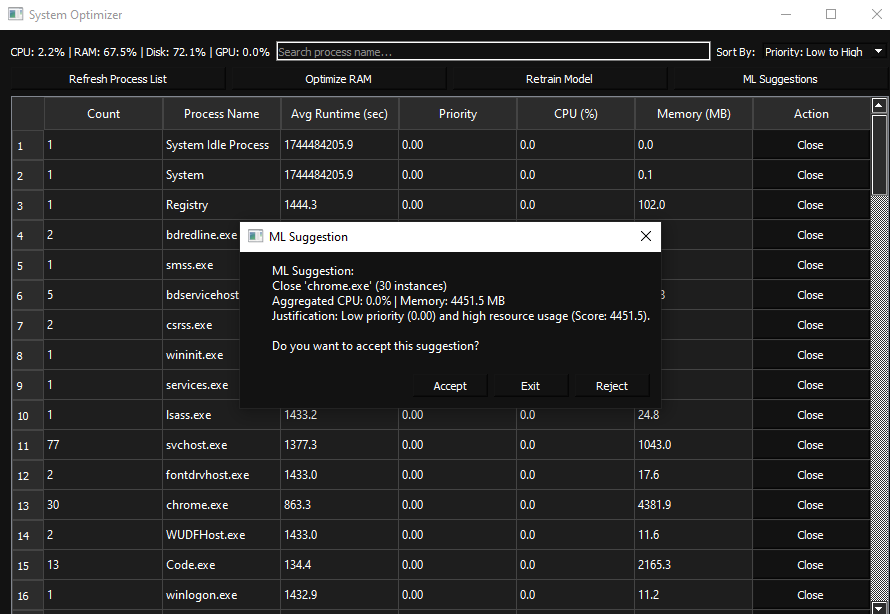

# CSI 4500 Task Manager Optimizer


This project is a task manager that leverages machine learning to recommend programs for closure, optimizing hardware usage.


&nbsp;
# How It's Made
Tech used: Python, PyQt, XGBoost

For this project, we used Python for the backend, PyQt for the front end, and XGBoost for the machine learning model. Python was used for the backend because python is widely used and supported for machine learning. We decided to use the Python PyQt library for the front end for easy low overhead communication with the backend, which is crucial for an optimizer. We chose XGBoost for out machine learning model because it is an open-source high efficiency and accuracy model that fits well with our project. 

To run the model we have two python files, collect_training_data.py to collect the data into the CSV file, and train_model.py which takes that file and trains the XGBoost model.

&nbsp;
## Requirements
To install all requirements for python, first initiate a venv then install python requirements in terminal. 

NOTE: In some linux distributions you will use python / pip instead of python3 / pip3

### Intializes venv and activates it
```
python3 -m venv venv

source venv/bin/activate 
```

### Download all dependencies
Before trying to run the application, go to your terminal and make sure your in the project directory and install all dependencies from requirements.txt.
```
pip3 install -r requirements.txt 
```


&nbsp;
# Running the Program
1. Enter your terminal:

2. Navigate to the project directory: 

3. Run ```python collect_training_data.py```

4. simultaneously Run ```python train_model.py```

5. Check that ml_model.pkl (and possibly label_encoder.pkl if applicable) exists in your backend folder.

6. Laslty launch the front end: ```python app.py```


